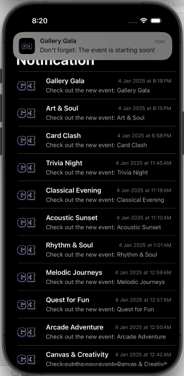

## Brief
GLOW EVENTS

Our project involves the development of an IOS Application named "Glow Events" utilizing the Swift Programming language. This Application is exclusively designed for Apple devices, ensuring a seamless experience for users within Apple Ecosystem. The app aims to provide a user-friendly platform that simplifies the booking process for varrious events, allowing users to easily navigate and access the services. Moreovere, Event Orrganizers can also have access to the app such as creating and manipulating their events. Lastly, Admins who built the application can monitor and manipulate the whole application mainly considering the events and users.

## Features 

Layla Marhoon:

1. Account and Role Based Features
2. User Notification

Sharmin Ali:

1. Personalized Event Recommendation
2. Event Highlights

Salman Khamis:

1. Organizer Event Browsing and Search
2. Event Management

Ahmed Awadhi:

1. Event Enrollment
2. Event Details and Reviews

Zainab Abdulhusain:

1. User Profile and Preferences
2. Content Moderation and Control

Thuraya Alsatrawi:

1. Event Insights
2. Administrative Control Panel

## Additional Features 
- **Firebase**

## Log In Credentials 

--------------------------------------------------------------------
| User Type       | Username                       | Password      |
| --------------- | ------------------------------ | ------------- |
| Admin           | admin@gmail.com                | ali012345     |
| Event Organizer | eventorganizeraldana@gmail.com | hussain012345 |
| User            | fatima@gmail.com               | fatima23      |
--------------------------------------------------------------------

## Screenshots
###### Launch Page

###### Sign Up Page

###### Log In Page

###### In App Notification

###### Lock Screen Notification

###### Local Notification

###### Reminders Notification

