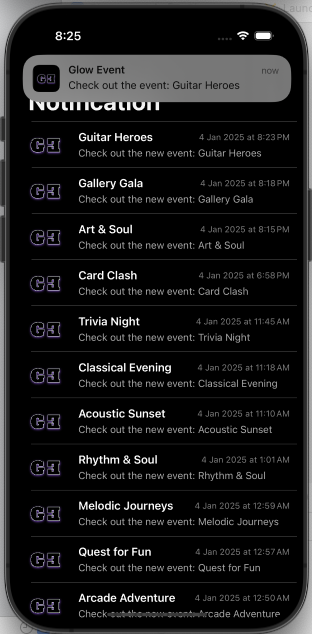

# GLOW EVENTS

Our project involves the development of an IOS Application named "Glow Events" utilizing the Swift Programming language. This Application is exclusively designed for Apple devices, ensuring a seamless experience for users within Apple Ecosystem. The app aims to provide a user-friendly platform that simplifies the booking process for varrious events, allowing users to easily navigate and access the services. Moreovere, Event Orrganizers can also have access to the app such as creating and manipulating their events. Lastly, Admins who built the application can monitor and manipulate the whole application mainly considering the events and users.

## Github Link

## Group Members

- **Layla Marhoon - 202200394**
- **Zainab Abdulhusain - 202201685**
- **Sharmin Ali - 202203334**
- **Thuraya Alsatrawi - 202201823**
- **Ahmed Awadhi - 202201533**
- **Salman Khamis - 202201782**

## Main Features (Developer & Tester)

---------------------------------------------------------------------------------------------------------------
|           Main Features                 |            Main Developer          |          Main Tester         |
| --------------------------------------- | ---------------------------------- | ---------------------------- |
| 1. Account and Role Based Features      |            Layla Marhoon           |       Thuraya Alsatrawi      |
| 2. User Notification                    |            Layla Marhoon           |       Salman Khamis          |
| 3. Personalized Event Recommendation    |            Sharmin Ali             |       Ahmed Awadhi           |
| 4. Event Highlights                     |            Sharmin Ali             |       Ahmed Awadhi           |
| 5. Organizer Event Browsing and Search  |            Salman Khamis           |       Zainab Abdulhusain     |
| 6. Event Management                     |            Salman Khamis           |       Layla Marhoon          |
| 7. Event Enrollment                     |            Ahmed Awadhi            |       Sharmin Ali            |
| 8. Event Details and Reviews            |            Ahmed Awadhi            |       Thuraya Alsatrawi      |
| 9. User Profile and Preferences         |            Zainab Abdulhusain      |       Layla Marhoon          |
| 10. Content Moderation and Control      |            Zainab Abdulhusain      |       Salman Khamis          |
| 11. Event Insights                      |            Thuraya Alsatrawi       |       Ahmed Awadhi           |
| 12. Administrative Control Panel        |            Thuraya Alsatrawi       |       Zainab Abdulhusain     |
---------------------------------------------------------------------------------------------------------------

## Additional Features 
- **Firebase**

## Log In Credentials 

--------------------------------------------------------------------
| User Type       | Username                       | Password      |
| --------------- | ------------------------------ | ------------- |
| Admin           | admin@gmail.com                | ali012345     |
| Event Organizer | eventorganizeraldana@gmail.com | hussain012345 |
| User            | fatima@gmail.com               | fatima23      |
--------------------------------------------------------------------

## Libraries, Packages, External Code Implementation

- **UIKit**
- **Firebase**
- **UNUserNotificationCenterDelegate**

## Simulators

- **iPhone 15 Pro**

## Screenshots
- **Layla Marhoon** 
###### Launch Page

###### Sign Up Page

###### Log In Page

###### In App Notification

###### Lock Screen Notification

###### Local Notification

###### Reminders Notification

